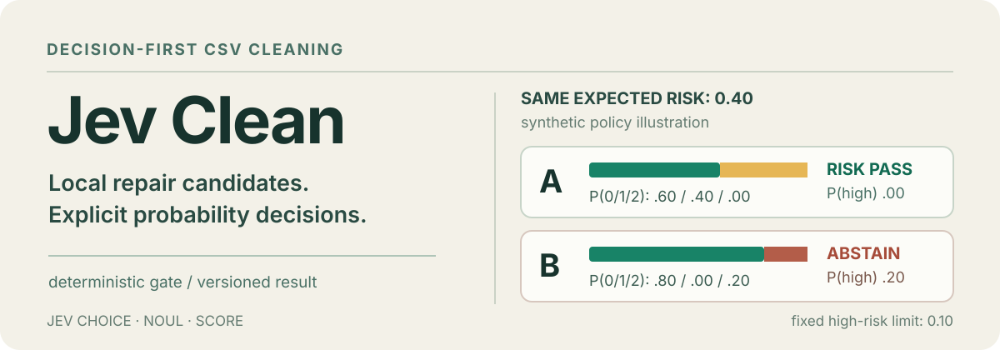

# Jev Clean

<p align="center">
  
</p>

**Decision-first CSV cleaning with an inspectable reason to apply—or abstain.**
Jev Clean builds bounded repair candidates in local code, asks
[Jev](https://docs.typesafe.ai/introduction) for explicit action,
applicability and semantic-risk distributions, then uses a fixed policy to
decide what may be applied. The model neither writes executable repairs nor
mutates the source CSV.

`v0.2.0 experimental` · Python 3.11–3.13 · MIT · [independent project](#status-and-scope)

## Why keep the full distribution?

The two **synthetic** risk distributions below have the same expected level,
`E[risk] = 0.40`, on Jev Clean's ordered `0 / 1 / 2` scale:

- **A:** `P(0, 1, 2) = (0.60, 0.40, 0.00)` — the risk checks pass.
- **B:** `P(0, 1, 2) = (0.80, 0.00, 0.20)` — the policy abstains because
  `P(high risk) = 0.20` exceeds the `0.10` limit.

These are a policy illustration, **not live Jev measurements**. An expected
score alone hides the high-risk tail; Jev Clean saves the full distribution,
the recomputed expectation, each threshold comparison and the final status.
Other eligibility and applicability checks must also pass before any repair
is committed.

A [recorded live demo](docs/implementation_status.md) on 2026-09-22 produced
10 candidates, 6 committed decisions and 4 abstentions, with an overall
`partial` outcome. The rule baseline repaired more of that demo dataset.
These observations show inspectability, not calibrated accuracy or superiority;
live model decisions can vary between runs.

## Run the demo

Install [uv](https://docs.astral.sh/uv/) and use Python 3.11, 3.12 or 3.13:

```bash
git clone https://github.com/Kunyanli230/jev-clean.git
cd jev-clean
uv sync --locked
uv run idac --help
```

The repository's default interpreter remains Python 3.11. To use an existing
Python 3.12 environment, run `uv sync --locked --python 3.12` and add
`--python 3.12` to `uv run` commands. CI checks all three supported versions.

The public project name is **Jev Clean**. The Python package and CLI remain
`idac`, so the commands below use that executable.

Start offline by inspecting the input and its authorized repair previews:

```bash
uv run idac profile \
  --input examples/data/dirty.csv \
  --config configs/demo.yaml \
  --output runs/input-profile.json
```

Use `--json` for the complete profile on stdout. Profiling leaves the original
cells unchanged; its previews describe independent possibilities on that
snapshot. Later candidates may become available after earlier repairs.

The Jev-guided clean requires a TypeSafe API key. In Bash or WSL, enter it
without adding its value to shell history:

```bash
read -rsp 'TypeSafe API key: ' TYPESAFE_API_KEY
echo
export TYPESAFE_API_KEY

uv run idac clean \
  --input examples/data/dirty.csv \
  --config configs/demo.yaml \
  --output runs/first-run

uv run idac inspect --run runs/first-run
unset TYPESAFE_API_KEY
```

Open `runs/first-run/report.md` and `runs/first-run/decision_cards.md` to
inspect the outcomes and per-candidate evidence. `cleaned.csv` is an export
of the committed snapshot; the input file is never overwritten. Choose a new
output path for each run. Live API calls consume provider quota and may incur
charges.

Without an API key, run the **rule-only baseline**. It uses the local
candidate builders and validator but makes no Jev calls and has no probability
decision records:

```bash
uv run idac baseline \
  --input examples/data/dirty.csv \
  --config configs/demo.yaml \
  --output runs/baseline-local
```

The previous `examples/run_baseline.py` entry point still works. Baseline
exports include a hashed snapshot that preserves row identities and nulls for
evaluation, including when a duplicate was removed from the middle of a CSV.
The baseline skips the Jev gate and semantic postcheck; it makes no model calls.

## How a repair reaches the output

1. A YAML schema authorizes operations per column. Profilers find issues and
   local code creates finite, exact candidate changes.
2. Four role agents route standardization, duplicate, outlier and missing-value
   candidates to Jev `Choice`, `Noul` and ordered `Score` questions.
3. A deterministic gate checks eligibility, choice confidence,
   `P(applicable)`, expected risk and highest-risk probability. Uncertain or
   invalid answers abstain instead of being silently normalized.
4. The planner and executor apply accepted candidates to a copy. Independent
   hard validation and a Jev semantic postcheck decide whether the batch
   becomes a versioned snapshot or is rejected.
5. Run artifacts keep the distributions, request evidence, policy values,
   actual changes and audit trail. Decisions can be replayed offline; a
   committed snapshot can be restored without contacting Jev.

See the [architecture](docs/architecture.md) for phase ordering, dependency
blocking, budgets and exact component boundaries. The coordinator and
executor are deterministic code, not extra model agents.

## What v0.2 handles

- One UTF-8 CSV, up to 10,000 rows and 30 columns, with a required
  [YAML configuration](configs/demo.yaml).
- Whitespace and declared null tokens; numeric and declared date formats;
  exact duplicates; declared range violations; bounded median/mode imputation.
- Protected columns and per-column operation allowlists. Unknown configuration
  fields are rejected.
- Versioned snapshots, rollback, offline policy replay, and comparison with a
  deterministic rule baseline.
- Offline profiling and a packaged rule-baseline command, with verifiable
  baseline row identities and exported-data consistency checks.

It does not perform fuzzy entity matching, free-text completion, unit
conversion, model training or direct database mutation. IQR outlier flags are
informational; they do not rewrite values by themselves.

## Inspect, evaluate and restore

```bash
uv run idac inspect --run runs/first-run --candidate-id CANDIDATE_ID
uv run idac evaluate \
  --run runs/first-run \
  --truth examples/data/ground_truth.csv
uv run idac rollback --run runs/first-run --to-version v000
```

`evaluate` uses ground truth only after cleaning; truth is not sent to Jev or
used to generate candidates. `rollback` changes the run's current snapshot,
not the original CSV. Each run keeps `decisions.jsonl`, `decision_traces.jsonl`,
`requests/`, `snapshots/`, `audit.jsonl` and human-readable reports. Missing or
modified request evidence makes offline replay non-replayable rather than
silently passing.

## Data and decision boundaries

Live calls send bounded candidate metadata, field descriptions, evidence
summaries and limited before/after samples to TypeSafe. The complete CSV,
snapshots and generated reports remain local. Review descriptions and sampled
values before using sensitive data. The `.env.example` file documents
`TYPESAFE_API_KEY`, but Jev Clean does not automatically load `.env` files.

The current implementation pins `typesafe-sdk 0.7.1` and the model ID
`jev-1.13.0`; this is not a claim that it is the latest model. Policy
thresholds are versioned in `src/idac/settings.py` and copied into decision
records. They are conservative project defaults, **not calibrated accuracy
guarantees**. A successful process exit or a committed snapshot is not proof
that every repaired value is correct.

## Develop

```bash
uv sync --locked
uv run python scripts/check_environment.py
uv run pytest -q
uv run ruff check src tests examples scripts
```

Tests use a labeled fake client at the SDK boundary and make no API calls.
The [v0.2 development notes](docs/v0.2.md) record scope, acceptance checks and
migration details. The [v0.1 implementation status](docs/implementation_status.md)
retains its historical test and live-demo measurements.

## Status and scope

Jev Clean is an experimental v0.2 release, not certified for production or
high-stakes data processing. Review its configuration, thresholds and proposed
changes before using cleaned data downstream. It is an independent project
built with the TypeSafe SDK, not an official TypeSafe product.

Licensed under [MIT](LICENSE).
