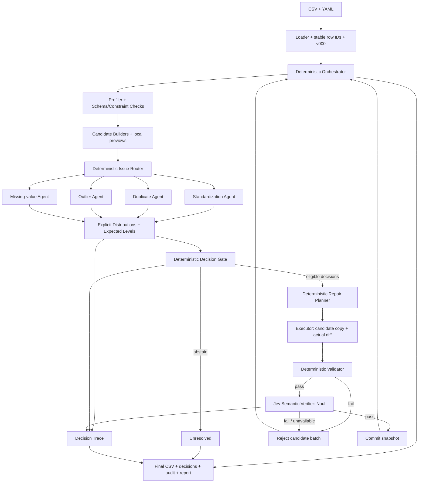

# IDAC architecture

IDAC (Interpretable Data Auto-Cleaner) cleans one UTF-8 CSV (max 10,000 rows,
30 columns) plus a required YAML configuration. Its deliverable is not only the
cleaned CSV but a checkable decision record for every model judgment: candidate,
evidence, complete probability distributions, ordered expected level, explicit
rule table and final commit status.

## Fixed scope

Four cleaning families are implemented:

1. Standardization: leading/trailing whitespace, explicit null tokens, numeric
   formats and declared date formats.
2. Missing values: numeric median, categorical mode.
3. Outliers: IQR flags only; declared range violations may become null and then
   enter missing-value handling.
4. Exact duplicates: compared on declared columns, keeping the earliest original
   row.

Jev decides whether to apply code-computed candidates. Abstaining and rejecting
keep the original values and are written to the report as unresolved. There is
no human approval UI, no fuzzy matching, no entity merging, no free-text
completion, no unit conversion, no model training, no web UI and no database.
The original CSV is never overwritten.

## Components

| Component | Input | Output |
|---|---|---|
| Profiler/Checkers (`profiling.py`) | current snapshot, YAML | counts, `Issue`, `Evidence`, `Selection` |
| Candidate Builders (`candidates.py`) | issue, local statistics | finite `RepairCandidate` with exact after-values and previews |
| Router (`agents.py`, `questions.py`) | issue category, phase | role agent and candidate batch |
| 4 Decision Agents (`agents.py`) | candidates, descriptions, previews | Choice distribution, Noul probability, Score distribution |
| Distribution Summarizer (`distributions.py`) | raw typed answers | option margin, recomputed expected level, variance, high-risk probability |
| Decision Gate (`policy.py`) | distributions, eligibility, policy snapshot | apply/abstain with every rule comparison and reason code |
| Decision Trace (`models.py`, `explanation.py`) | evidence, questions, distributions, rules | offline-replayable record and decision card |
| Planner (`planner.py`) | accepted candidates | version-bound, conflict-free `RepairPlan` |
| Executor (`executor.py`) | plan, current snapshot | candidate copy, complete actual diff, removed rows |
| Hard Validator (`validator.py`) | before/after data, plan, config | exact check results |
| Semantic Verifier (`orchestrator.py`) | actual diff samples, business descriptions | per-operation semantic-error probability (Noul) |
| Storage/Report (`storage.py`, `report.py`) | committed state, history | snapshots, exports, audit logs, Markdown report |

`agents.py` contains four short role classes that share question assembly and
the gate; there is no separate agent framework.

## Flow



The control layer owns phases and budgets; the four experts own domain
judgments; the Jev verifier checks the semantics of real modifications; Planner,
Executor and Hard Validator are code.

## Sub-phases and dependency blocking

```text
trim -> null normalization -> numeric cast -> date parsing
     -> exact duplicates -> out-of-range invalidation -> missing-value imputation
```

Every sub-phase re-checks the current snapshot, builds candidates from local
facts, decides, plans, executes, hard-validates, semantically verifies and then
commits or rejects before re-checking. A commit immediately creates a new
version; later batches are rebuilt from the new version and never reuse old
selections or imputation statistics.

Dependency rules:

- A column with unresolved parse/format issues blocks its range and imputation
  work; unrelated columns continue.
- Duplicate grouping only includes rows whose compare-column values are already
  canonical or originally valid; other rows are excluded and reported as
  dependency-blocked.
- Rejected candidates are never re-sampled; identical operations are not asked
  again.

## Cells, snapshots and versions

In memory and in JSON snapshots every cell is a `str` or `null`. Successful
numeric conversions store canonical decimal strings without thousands
separators; dates store `YYYY-MM-DD`. Logical types come from the YAML schema,
never from Python storage types. CSV export writes null as an empty field.

`DatasetState` carries version id, parent, input hash, ordered columns, stable
row ids (`row-000000` by original input order), rows, schema, removed rows,
issues and selections. The manifest holds the version parent chain, the current
pointer, outcome and stop reason.

## Decision triple and gate

Each candidate asks exactly three independent questions in one batch (max four
candidates, twelve questions):

1. `Choice` between the candidate id and `keep_original`.
2. `Noul` for whether the field description and policy support the required
   business assumption.
3. `Score` over three ordered semantic-risk levels 0/1/2.

The gate evaluates every rule without short-circuiting:

| Rule | Comparison |
|---|---|
| `HARD_ELIGIBILITY` | authorized operation, unprotected column, current version |
| `MODEL_STATUS` | `ok` |
| `CHOICE_SELECTION` | selected option == candidate id |
| `CHOICE_CONFIDENCE` | `>= 0.80` |
| `APPLICABLE_PROBABILITY` | `>= 0.80` |
| `SCORE_EXPECTATION_CONSISTENT` | `abs(sdk_score - recomputed) <= 0.03` |
| `EXPECTED_RISK_LEVEL` | `<= 0.50` |
| `HIGH_RISK_PROBABILITY` | `P(L=2) <= 0.10` |

Every rule stores metric, observed value, operator, threshold, status and reason
code. The expected level is always recomputed from the full distribution, so a
stored decision can be replayed offline. The synthetic A/B example (same
expected level 0.40, different tail risk) is rendered in every report and
covered by fixed tests; it is explicitly labeled synthetic.

Fixed **synthetic illustration** (also rendered in every report and asserted in
fixed tests; not a real Jev result):

| Example | P(0) | P(1) | P(2) | Expected level μ | Variance | Expected-level gate | High-risk gate |
|---|---:|---:|---:|---:|---:|---|---|
| A | 0.60 | 0.40 | 0.00 | 0.40 | 0.24 | pass | pass |
| B | 0.80 | 0.00 | 0.20 | 0.40 | 0.64 | pass | fail |

A and B share μ = 0.40, but B has P(L=2) = 0.20 above the 0.10 limit and must
abstain. A single score cannot explain the different risk structure; the full
distribution is stored, displayed and used by the gate.

`replay_decision(record)` reads only stored distributions, eligibility and the
historical policy snapshot. It never calls the model and reports non-replayable
records (for example missing request references) instead of pretending
consistency.

## Budget, retry and context limits

- One retry layer in `typesafe_client.py`; the SDK's own retries are disabled
  with `RetryPolicy(max_retries=0)`.
- 429, 529, network errors and timeouts retry at most once; 401 aborts the run;
  422 and invalid responses are non-retryable request failures.
- Budgets: 120 actual attempts, 200,000 known input tokens, 45 s per request,
  10 minutes per run. Every attempt is budget-checked and recorded.
- Requests are at most 24 KiB of UTF-8 JSON: batch size is reduced first, then
  samples; if nothing fits, the candidate stays unresolved and truncation is
  audited.
- Only relevant configuration, bounded evidence and at most eight samples per
  candidate leave the machine. Truth and corruption manifests never enter the
  model state.

## Storage layout

A run directory contains `manifest.json`, `config.yaml`, `cleaned.csv`,
`removed_rows.csv`, `issues.json`, `decisions.jsonl`,
`decision_traces.jsonl`, `changes.jsonl`, `audit.jsonl`, `validation.json`,
`report.md`, `decision_cards.md`, `requests/` and `snapshots/`. Decision,
change and audit logs are append-only; report metrics only count modifications
on the current version's ancestor chain, and rolled-back or rejected work is
shown separately.

`rollback` restores a committed snapshot and its exports, appends an audit
event and never calls the model. Evaluation results are bound to a version
(`evaluation_vNNN.json`) and are hidden after a rollback.

## CLI

```bash
uv run idac clean --input examples/data/dirty.csv --config configs/demo.yaml --output runs/demo
uv run idac inspect --run runs/demo [--candidate-id CANDIDATE]
uv run idac evaluate --run runs/demo --truth examples/data/ground_truth.csv [--baseline runs/baseline]
uv run idac rollback --run runs/demo --to-version v000
```

`clean` refuses an existing output directory and refuses to start without
`TYPESAFE_API_KEY`; it never falls back to a fake client or the rule baseline.
